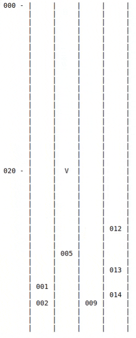

# Behavior Planner
Simulator for navigating highway traffic using a behavior planner.
The behavior planner is given a target position at some distance down
the road and is responsible for safely navigating through traffic to
reach the goal as quickly as possible.

